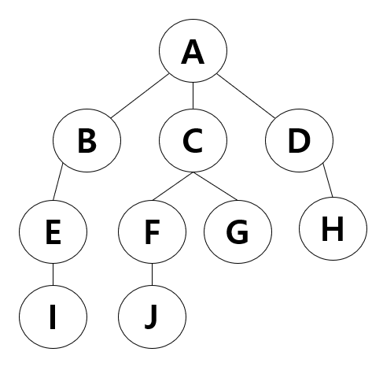

# DFS and BFS

> 그래프 알고리즘으로 경로를 찾을 때 많이 사용하게 된다.
> 방식은 DFS, BFS 모두 인접 리스트 / 인접 행렬 or 방식으로 구현이 가능하다.

## DFS (Depth-First Search)

> 루트 노드 혹은 임의 노드에서 다음 브랜치로 넘어가기 전에, 해당 브랜치를 모두 탐색하는 방법

스택 or 재귀함수를 통해 구현한다.

`모든 경로를 방문해야 할 경우 사용에 적합`


### DFS 시간 복잡도

- 인접 행렬 : O(V^2)
- 인접 리스트 : O(V+E)

> V는 접점, E는 간선을 뜻한다

### DFS 구현 방식

1. 탐색 시작 노드를 스택에 삽입하고 방문 처리한다.
1. 스택의 최상단 노드에 방문하지 않은 인접 노드가 있다면 그 인접 노드를 스택에 넣고 방문 처리한다.

   - 방문하지 않은 인접 노드가 없으면 스택에서 최상단 노드를 꺼낸다.

1. 2번의 과정을 더 이상 수행할 수 없을 때까지 반복한다.

### DFS Example

```py
# N×N 2차원 배열

dy = (-1, 0, 1, 0)
dx = (0, 1, 0, -1)

# 방문한 노드일 경우 True / 방문하지 않은 노드일 경우 False
visited = [[False for _ in range(N)] for _ in range(N)]


def DFS(r, c):
    # 현재 탐색 중인 노드 (r, c)
    visited[r][c] = True

    route = []  # 탐색 경로 저장
    route.append((r, c))

    for i in range(4):
        # 인접 노드 (ny, nx)
        ny = r + dy[i]
        nx = c + dx[i]

        # 조건문을 통해 탐색 가능한 노드인지 확인
        if 0 <= ny < N and 0 <= nx < N and not visited[ny][nx]:
            route.append((ny, nx))
            DFS(ny, nx)  # 재귀

    return route
```



## BFS (Breadth First Search)

> 루트 노드 또는 임의 노드에서 인접한 노드부터 먼저 탐색하는 방법

큐를 통해 구현한다. (해당 노드의 주변부터 탐색해야하기 때문)

`최소 비용(즉, 모든 곳을 탐색하는 것보다 최소 비용이 우선일 때)에 적합`


### BFS 시간 복잡도

- 인접 행렬 : O(V^2)
- 인접 리스트 : O(V+E)

> V는 정점, E는 간선을 뜻한다

### BFS 구현 방식

1. 탐색 시작 노드를 큐에 삽입하고 방문 처리
1. 큐에서 노드를 꺼내 해당 노드의 인접 노드 중에서 방문하지 않은 노드를 모두 큐에 삽입하고 방문 처리
1. 2번의 과정을 더 이상 수행할 수 없을 때까지 반복

### BFS Example

```py
# N×N 2차원 배열

dy = (-1, 0, 1, 0)
dx = (0, 1, 0, -1)

# 방문한 노드일 경우 True / 방문하지 않은 노드일 경우 False
visited = [[False for _ in range(N)] for _ in range(N)]


def BFS(r, c):
    q = deque()  # 탐색해야 하는 노드들을 담는 큐

    # 탐색을 시작하는 노드 (r, c)
    q.append((r, c))
    visited[r][c] = True

    route = []  # 탐색 경로 저장
    route.append((r, c))

    # 큐에 들어가 있는 노드가 없을 때까지(탐색이 완료될 때까지) 반복
    while q:
        # 현재 탐색 중인 노드 (y, x)
        y, x = q.popleft()

        for i in range(4):
            # 인접 노드 (ny, nx)
            ny = y + dy[i]
            nx = x + dx[i]

            # 조건문을 통해 탐색 가능한 노드인지 확인
            if 0 <= ny < N and 0 <= nx < N and not visited[ny][nx]:
                visited[ny][nx] = True
                q.append((ny, nx))  # 인접한 노드를 전부 탐색하기 위해 큐에 다시 append
                route.append((ny, nx))

    return route
```

#### References

[https://velog.io/@roro/%EC%9E%90%EB%A3%8C%EA%B5%AC%EC%A1%B0%EC%95%8C%EA%B3%A0%EB%A6%AC%EC%A6%98-%EA%B7%B8%EB%9E%98%ED%94%84-DFS-BFS](https://velog.io/@roro/%EC%9E%90%EB%A3%8C%EA%B5%AC%EC%A1%B0%EC%95%8C%EA%B3%A0%EB%A6%AC%EC%A6%98-%EA%B7%B8%EB%9E%98%ED%94%84-DFS-BFS)
