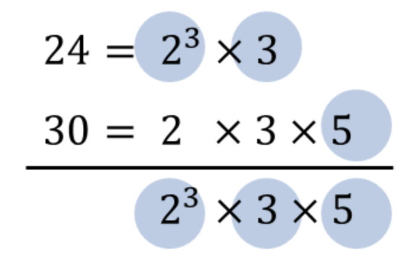

# lcm, gcd

## 정의

LCM(`Lowest Common Multiple`), 최소공배수란 두 수 이상의 여러 수의 공배수 중 최소인 수를 가리킨다.


GCD(`Greatest Common Divisor`), 최대공약수란 두 수 이상의 여러 수의 공약수 중 최대인 수를 카리킨다.


## GCD 구현 방식

### 유클리드 호제법을 이용한 최대공약수

두 개의 자연수에 대한 최대 공약수를 구하는 대표적인 알고리즘

> 유클리드 호제법 : 두 자연수 A, B에 대하여 (A>B) A를 B로 나눈 나머지를 R이라고 할 때 A, B의 최대공약수는 B와 R의 최대공약수와 같다

```py
def gcd(a, b):
    if a % b == 0:
        return b
    else:
        return gcd(b, a % b) # b와 a를 b로 나눈 나머지를 반환
```

두 수중 큰 수를 작은 수로 나눴을 때 나머지가 0이 되면 이것이 최대 공약수인데, 만약에 나누어 떨어지지 않는다면 B와 A를 B로 나눈 나머지인 R을 반환하는 재귀함수이다.

## LCM 구현 방식

### 유클리드 호제법을 이용한 최소공배수

- 두 수를 곱한 것을 그 두 수의 최대공약수로 나누면 최소공배수가 된다.

```py
def lcm(a, b):
    return (a*b) // gcd(a, b)
```

### 유클리드 호제법을 이용한 코드 수정

```py
def gcd(n, m):
    if n%m == 0:
        return m
    else:
        return gcd(m, n%m)

def solution(n, m):
    answer = [gcd(m, n), n*m // gcd(m,n)]
    return answer
```
